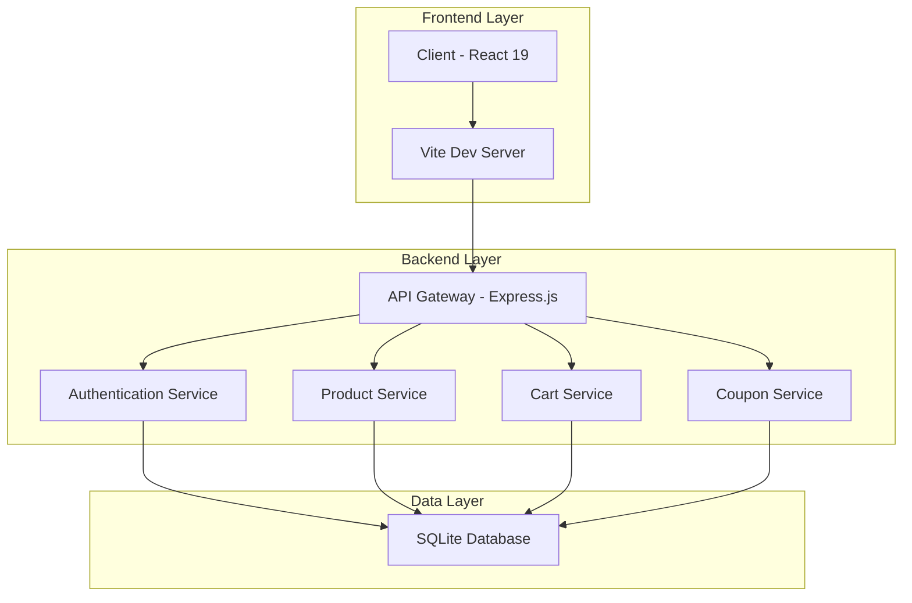

# 🛍️ SHEIN Clone - E-commerce Full-Stack

<div align="center">


**Un e-commerce completo y escalable construido con tecnologías modernas**

[🚀 Demo en Vivo](#) • [📖 Documentación](#) • [🐛 Reportar Issues](https://github.com/bmontes93/shein-clone/issues)

</div>

---

## 📋 Tabla de Contenidos

- [✨ Características](#-características)
- [🏗️ Arquitectura](#️-arquitectura)
- [🛠️ Stack Tecnológico](#️-stack-tecnológico)
- [🚀 Inicio Rápido](#-inicio-rápido)
- [📁 Estructura del Proyecto](#-estructura-del-proyecto)
- [🔧 Configuración](#-configuración)
- [📡 API Reference](#-api-reference)
- [🎨 UI/UX Features](#-uiux-features)
- [🔒 Seguridad](#-seguridad)
- [📊 Rendimiento](#-rendimiento)
- [🧪 Testing](#-testing)
- [🚀 Despliegue](#-despliegue)
- [🔧 Scripts Disponibles](#-scripts-disponibles)
- [🤝 Contribución](#-contribución)
- [📝 Licencia](#-licencia)
- [👨‍💻 Autor](#-autor)
- [🙏 Agradecimientos](#-agradecimientos)

---

## 🏗️ Arquitectura



### 🏛️ **Patrones de Diseño Implementados**

- **MVC Architecture** - Separación clara de responsabilidades
- **Repository Pattern** - Abstracción de la capa de datos
- **Service Layer** - Lógica de negocio centralizada
- **Middleware Pattern** - Procesamiento de requests/response
- **Observer Pattern** - Gestión de estado reactiva
- **Factory Pattern** - Creación de objetos complejos

---

## 🛠️ Stack Tecnológico

### 🎨 **Frontend**

```json
{
  "React": "19.1.1",
  "Vite": "7.1.2",
  "Tailwind CSS": "3.4.1",
  "React Router": "7.8.2",
  "Axios": "1.11.0",
  "Context API": "Built-in"
}
```

### ⚙️ **Backend**

```json
{
  "Node.js": "18+",
  "Express.js": "5.1.0",
  "Database": "SQLite (Dev) / Postgres (Prod)",
  "ORM": "TypeORM 0.3.x",
  "JWT": "jsonwebtoken",
  "bcrypt": "bcryptjs",
  "CORS": "2.8.5"
}
```

### 🛠️ **DevOps & Tools**

```json
{
  "ESLint": "9.33.0",
  "Prettier": "Auto-formatting",
  "Git": "Version Control",
  "npm": "Package Management",
  "Postman": "API Testing"
}
```

---

## ✨ Características

### 🎯 **Funcionalidades Core**

- ✅ **Autenticación JWT** - Login/registro seguro con tokens
- ✅ **Carrito de Compras** - Persistente con gestión de stock
- ✅ **Sistema de Productos** - CRUD completo con variantes
- ✅ **Lista de Deseos** - Wishlist personalizada
- ✅ **Sistema de Reseñas** - Calificaciones y comentarios
- ✅ **Gestión de Stock** - Control dinámico por tallas/colores
- ✅ **Cupones y Descuentos** - Sistema completo de promociones
- ✅ **Búsqueda Avanzada** - Filtros y paginación
- ✅ **Múltiples Imágenes** - Galería con zoom y miniaturas

### 🎨 **Experiencia de Usuario**

- ✅ **Responsive Design** - Optimizado para móvil, tablet y desktop
- ✅ **UI Moderna** - Tailwind CSS con componentes reutilizables
- ✅ **Loading States** - Feedback visual en todas las operaciones
- ✅ **Error Handling** - Mensajes amigables y recuperación
- ✅ **SEO Friendly** - Meta tags y estructura semántica
- ✅ **Accesibilidad** - Soporte para lectores de pantalla

### ⚡ **Rendimiento y Escalabilidad**

- ✅ **Lazy Loading** - Carga diferida de imágenes
- ✅ **API Caching** - Sistema de caché inteligente
- ✅ **Image Optimization** - Compresión y formatos optimizados
- ✅ **Code Splitting** - Carga modular de componentes
- ✅ **Database Indexing** - Consultas optimizadas
- ✅ **Rate Limiting** - Protección contra abuso

### 🔄 En Desarrollo

- Integración con pasarelas de pago
- Sistema de notificaciones
- Panel de administración
- API de envío y tracking

## 🛠️ Tecnologías Utilizadas

### Frontend

- **React 19** - Framework moderno de JavaScript
- **Vite** - Build tool ultrarrápido
- **Tailwind CSS** - Framework de estilos utilitario
- **React Router** - Navegación SPA
- **Axios** - Cliente HTTP
- **Context API** - Gestión de estado global

### Backend

- **Node.js** - Runtime de JavaScript
- **Express.js** - Framework web minimalista
- **SQLite** - Base de datos SQL ligera y rápida
- **TypeORM** - ORM potente para TypeScript/JavaScript
- **JWT** - Autenticación segura
- **bcrypt** - Hashing de contraseñas
- **CORS** - Control de acceso cross-origin

### DevOps & Tools

- **ESLint** - Linting de código
- **Prettier** - Formateo de código
- **Git** - Control de versiones
- **npm** - Gestión de paquetes

## 📁 Estructura del Proyecto

/
├── backend/
│ ├── controllers/ # Controladores de la API
│ ├── middleware/ # Middlewares personalizados
│ ├── models/ # Modelos de MongoDB
│ ├── routes/ # Definición de rutas
│ ├── uploads/ # Archivos subidos
│ ├── .env.example # Variables de entorno
│ └── server.js # Punto de entrada del servidor
├── frontend/
│ ├── public/ # Archivos estáticos
│ ├── src/
│ │ ├── components/ # Componentes reutilizables (UI, Layout)
│ │ ├── context/ # Context API global (e.g., Theme)
│ │ ├── features/ # Estructura basada en features (Auth, Cart, Products, Wishlist)
│ │ │ ├── auth/ # Hooks, componentes y páginas de Auth
│ │ │ ├── cart/ # Lógica y componentes de Carrito
│ │ │ ├── products/# Lógica y componentes de Productos
│ │ │ └── wishlist/# Lógica y componentes de Wishlist
│ │ ├── hooks/ # Hooks globales
│ │ ├── pages/ # Páginas principales (Home)
│ │ ├── services/ # Servicios de API
│ │ ├── utils/ # Utilidades y configuración
│ │ ├── App.tsx # Componente principal (Rutas)
│ │ └── main.tsx # Punto de entrada
│ └── .env.example # Variables de entorno
├── .gitignore # Archivos ignorados por Git
├── LICENSE # Licencia MIT
└── README.md # Este archivo

````

## 🚀 Instalación y Configuración

### Prerrequisitos

- Node.js (v18 o superior)
- SQLite (Incuido en el proyecto)
- npm o yarn

### Backend Setup

```bash
cd backend
npm install
cp .env.example .env
# Editar .env con tus configuraciones
npm run seed  # Opcional: poblar base de datos
npm run dev   # Iniciar servidor en modo desarrollo
````

### Frontend Setup

```bash
cd frontend
npm install
cp .env.example .env
# Editar .env con tus configuraciones
npm run dev   # Iniciar aplicación
```

### Variables de Entorno

#### Backend (.env)

```env
PORT=5000
NODE_ENV=development
DB_TYPE=sqlite
DB_DATABASE=database.sqlite
JWT_SECRET=tu_jwt_secret_seguro
JWT_EXPIRE=30d
FRONTEND_URL=http://localhost:3000
```

#### Frontend (.env)

```env
VITE_API_URL=http://localhost:5000
VITE_APP_NAME=SHEIN Clone
VITE_APP_VERSION=1.0.0
```

## 📜 Scripts Disponibles

### Backend

```bash
npm start      # Iniciar servidor en producción
npm run dev    # Iniciar con nodemon (desarrollo)
npm run seed   # Poblar base de datos con datos de prueba
npm run seed:destroy  # Limpiar base de datos
```

### Frontend

```bash
npm run dev    # Iniciar servidor de desarrollo
npm run build  # Construir para producción
npm run preview # Vista previa de build
npm run lint   # Ejecutar ESLint
```

## 🔌 API Endpoints

### Productos

- `GET /api/products` - Obtener todos los productos (con paginación)
- `GET /api/products/:id` - Obtener producto específico
- `GET /api/products/categories` - Obtener categorías
- `GET /api/products/featured` - Productos destacados

### Autenticación (Próximamente)

- `POST /api/auth/login` - Iniciar sesión
- `POST /api/auth/register` - Registrar usuario
- `GET /api/auth/profile` - Obtener perfil de usuario

### Carrito (Próximamente)

- `GET /api/cart` - Obtener carrito
- `POST /api/cart` - Agregar producto al carrito
- `PUT /api/cart/:id` - Actualizar cantidad
- `DELETE /api/cart/:id` - Eliminar producto

## 🎨 Características de UI/UX

- **Responsive Design**: Optimizado para móvil, tablet y desktop
- **Dark/Light Mode**: Soporte para temas (planeado)
- **Loading States**: Indicadores de carga en todas las operaciones
- **Error Handling**: Mensajes de error amigables
- **Smooth Animations**: Transiciones suaves con CSS
- **Accessibility**: Soporte para lectores de pantalla

## 🔒 Seguridad

- **JWT Authentication**: Tokens seguros para autenticación
- **Password Hashing**: bcrypt para encriptación de contraseñas
- **Input Validation**: Validación de datos en frontend y backend
- **CORS**: Control de acceso cross-origin
- **Rate Limiting**: Protección contra ataques de fuerza bruta
- **XSS Protection**: Sanitización de inputs

## 📊 Rendimiento

- **Code Splitting**: Carga diferida de componentes
- **Image Optimization**: Compresión y lazy loading
- **Caching**: Estrategias de cache implementadas
- **Bundle Analysis**: Optimización del tamaño del bundle
- **SEO Friendly**: Meta tags y estructura semántica

## 🧪 Testing

```bash
# Backend tests
cd backend
npm test

# Frontend tests
cd frontend
npm test
```

## 🚀 Despliegue

### Backend (Railway, Heroku, etc.)

```bash
npm run build
npm start
```

### Frontend (Vercel, Netlify, etc.)

```bash
npm run build
# Desplegar carpeta 'dist'
```

## 🤝 Contribución

¡Tu contribución es bienvenida! Por favor lee nuestra [Guía de Contribución](CONTRIBUTING.md) para detalles sobre:

- 📋 **Proceso de desarrollo**
- 🐛 **Reportar bugs**
- 💡 **Sugerir features**
- 🔄 **Pull requests**
- 🧪 **Testing**
- 📚 **Documentación**

### Quick Start para Contribuidores

```bash
# 1. Fork y clone
git clone https://github.com/bmontes93/shein-clone.git

# 2. Instalar dependencias
npm install

# 3. Configurar entorno
cp .env.example .env

# 4. Ejecutar proyecto
npm run dev

# 5. Crear rama
git checkout -b feature/nueva-funcionalidad
```

## 📝 Licencia

Este proyecto está bajo la **Licencia MIT** - ver el archivo [LICENSE](LICENSE) para más detalles.

```text
MIT License - Copyright (c) 2024 Bryan Montes

Permiso para usar, copiar, modificar y distribuir este software...
```

## 👨‍💻 Autor

**Bryan Montes**

- 🎯 **Rol**: Full-Stack Developer
- 🌐 **Portfolio**:
- 📧 **Email**: [bmontesr930620@gmail.com](mailto:bmontesr930620@gmail.com)
- 🐙 **GitHub**: [bmontes93](https://github.com/bmontes93)

### 🚀 Tecnologías que Domino

- **Frontend**: React, Next.js, Vue.js, TypeScript
- **Backend**: Node.js, Express, Python, FastAPI
- **Database**: MongoDB, PostgreSQL, MySQL
- **Cloud**: AWS, Vercel, Railway, Docker
- **Tools**: Git, CI/CD, Testing, DevOps

## 🙏 Agradecimientos

### 🎯 **Tecnologías Core**

- **[React 19](https://reactjs.org/)** - Framework web moderno
- **[Express.js](https://expressjs.com/)** - Framework backend minimalista
- **[TypeORM](https://typeorm.io/)** - ORM TypeScript
- **[SQLite](https://www.sqlite.org/index.html)** - Base de datos SQL
- **[Tailwind CSS](https://tailwindcss.com/)** - Framework CSS utilitario
- **[Vite](https://vitejs.dev/)** - Build tool ultrarrápido

### 🛠️ **Herramientas de Desarrollo**

- **[ESLint](https://eslint.org/)** - Linting y calidad de código
- **[Prettier](https://prettier.io/)** - Formateo automático
- **[GitHub Actions](https://github.com/features/actions)** - CI/CD
- **[Dependabot](https://dependabot.com/)** - Actualizaciones automáticas

### 🎨 **Inspiración y Diseño**

- **[SHEIN](https://us.shein.com/)** - Inspiración de UX/UI
- **[Material Design](https://material.io/)** - Principios de diseño
- **[Open Source Community](https://opensource.org/)** - Comunidad colaborativa

### 👥 **Contribuidores**

¡Gracias a todos los contribuidores que hacen este proyecto mejor!

<a href="https://github.com/tu-usuario/shein-clone/graphs/contributors">
  
</a>

---

## 📞 Contacto y Soporte

### 💬 **¿Necesitas Ayuda?**

- 📧 **Email**: [bmontesr930620@gmail.com](mailto:bmontesr930620@gmail.com)
- 💬 **Discussions**: [GitHub Discussions](https://github.com/bmontes93/shein-clone/discussions)
- 🐛 **Issues**: [GitHub Issues](https://github.com/bmontes93/shein-clone/issues)
- 📖 **Wiki**: [Project Wiki](https://github.com/bmontes93/shein-clone/wiki)

### 🌟 **Feedback**

¡Tu opinión es importante! Ayúdanos a mejorar creando:

- ⭐ **Issues** para bugs o mejoras
- 💡 **Discussions** para preguntas generales
- 📝 **Pull Requests** para contribuciones de código

---

<div align="center">

## 🎉 **¡Gracias por tu interés en SHEIN Clone!**

**Este proyecto demuestra habilidades avanzadas en desarrollo full-stack moderno**

### 📊 **Estadísticas del Proyecto**


### 🚀 **¡Haz que tu portafolio destaque!**

⭐ **Si te gusta este proyecto, dale una estrella y compártelo**

---

**Desarrollado con ❤️ por Bryan Montes**

_Última actualización: Diciembre 2025_

</div>
